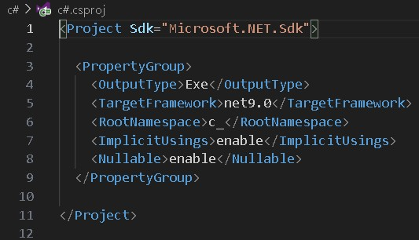
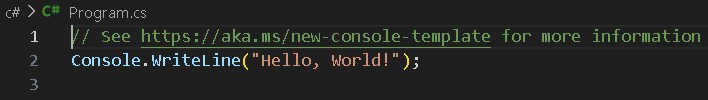

# Tipos de Projetos

## Console Application (Aplicação de Console)

Um programa que roda no terminal ou no prompt de comando (CLI). Ele não possui interface gráfica (GUI), sendo ideal para aplicações simples, scripts ou aprendizado.

### Uso Comum:
* Scripts utilitários.
* Prototipação ou aprendizado de conceitos.
* Ferramentas automatizadas de linha de comando.

Para criar esse tipo de projeto utilizamos o comando:

```powershell
dotnet new console -n NomeDoProjeto
```

* Substitua NomeDoProjeto pelo nome que deseja dar ao seu projeto.
* O comando acima cria uma pasta com o nome do projeto contendo os arquivos necessários

### Estrutura de Pastas

<p align="left">
  
</p>

1. **bin** = Carrega os arquivos binarios
2. **obj** = Carrega arquivos de debug
3. **c#.csproj** = Arquivo de projeto do c#, ele carrega alguns informações essnêciais para o projeto (metada dados)
    <p align="left">
    
    </p>

    * Utiliza linaguem xml 
4. **Program.cs** = Arquivo da classe, ou seja, arquivo onde ficara toda codificação
  * Ponto de entrada do sistema
  * Os arquivos de código sempre serão .cs
    <p align="left">
    
    </p>