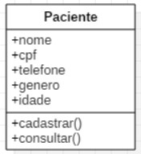

# Classe

A classe está relacionada ao conceito de abstração na programação orientada a objetos.

## Abstração

Nada mais é do que pegar um objeto do mundo real e transformá-lo em um objeto da programação, para que seja possível trabalhar com ele e implementar algumas ações.

<p align="center">
  
</p>

* **Classe** = paciente
* **Atributos** = nome, CPF, telefone, genero, idade
* **Métodos(Ações)** = cadastrar, consultar

### Criação de Classes

Para criar uma classe utilizando a IDE VS Code, basta:

1. Criar a pasta Models
    * As classes devem sempre ser organizadas em uma pasta chamada ``Models``.
        <p align="left">
        
        </p>
2. Clique com o botão direito do mouse sobre a pasta ``Models``.
3. Colocar o mouse sobre o ``New C#``.
4. Escolher a opção class.
5. Informar um nome para a classe.
    * Um arquivo .cs será criado com um código semelhante ao mostrado abaixo.
        * **namespace** = É uma organização das classes que representa um caminho lógico para identificar classes no mesmo domínio.
        * **Class** = Informa que esta sendo criado uma classe.
        * **Pessoa** = Representa o nome da classe.
        * **{ }** = Representa o escopo de um código, onde ele se começa e termina.
            ```c#
            using System;
            using System.Collections.Generic;
            using System.Linq;
            using System.Threading.Tasks;

            namespace C#.Models
            {
                public class Pessoa
                {
                    
                }
            }
            ```

### Criando Propriedades

Após criar uma classe, podemos adicionar os atributos. Para isso, basta:

1. Dentro da classe, digitar a palavra ``prop`` e confirmar com enter
    * O código será auto-completado como mostrado abaixo.
    ```c#
    using System;
    using System.Collections.Generic;
    using System.Linq;
    using System.Threading.Tasks;

    namespace C#.Models
    {
        public class Pessoa
        {
            public int MyProperty { get; set; }
        }
    }
    ```
2. Alterar o tipo e nome da propriedade conforme necessario.
    * Os nomes devem inciar com letra maiúscula
    ```c#
    public string Nome { get; set; }
    public int Idade { get; set; }
    ```

### Criando Métodos

Após possuir uma classe e suas propriedades declaradas, podemos adicionar os métodos. Para isso, basta fazer como o exemplo:

* **Apresentar** = Representa o nome do método
* **( )** = Informa que o método é uma ação/função
* **(Parâmetro/Argumento)** = O valor dentro dos parênteses são chamados de parâmetros ou argumentos
*

Se repararmos:

* **Console** = Tambem representa uma classe
* **WriteLine** = Tambem representa um método

    ```c#
    public void Apresentar(){
        Console.WriteLine($"Olá, meu nome é {Nome}, e tenho {Idade} anos")
    }
    ```

    #### Exemplo com Quebra de Linha

    * Podemos realizar quebras de linhas nos parametros informados, para isso utilizamos o ``\n``.
    
    ```c#
    public void Apresentar(){
        Console.WriteLine($"Olá, meu nome é {Nome}, \n e tenho {Idade} anos")
    }
    ```

    #### Exemplo Completo

    ```c#
    using System;
    using System.Collections.Generic;
    using System.Linq;
    using System.Threading.Tasks;

    namespace C#.Models
    {
        public class Pessoa
        {
            public string Nome { get; set; }
            public int Idade { get; set; }

            public void Apresentar(){
                Console.WriteLine($"Olá, meu nome é {Nome}, e tenho {Idade} anos");
            }
        }
    }
    ```

## Instânciar Classes

Para criar uma nova instância de uma classe, fazemos da seguinte forma:
* **Pessoa** = Representa que a classe é do tipo pessoa
* **pessoa1** = É uma variavel
* **New Pessoa()** = Cria a instância com a classe Pessoa

    ```c#
    Pessoa pessoa1 = new Pessoa();
    ```

Neste exemplo a instância esta sendo criada dentro do ``Program.cs``, então pode ser necessario ter que "Importar a classe Pessoa"
* Para isto utiliza-se o ``using`` seguido do ``namespace`` de onde esta a classe

    ```c#
    using exemplos.Models;
    ```

#### Exemplo Completo

```c#
using exemplos.Models;

Pessoa pessoa1 = new Pessoa();
```

### Atribuindo Valores

Para atribuir valor aos métodos, fazemos da seguinte forma:
* Utilizamos a ``instância.`` para chamar o método desejado.
* Atribuimos valores utilizando o sinal de igual

```c#
pessoa1.Nome = "João";
pessoa1.Idade = 26;
pessoa1.Apresentar();
```