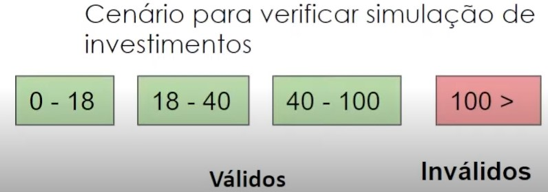
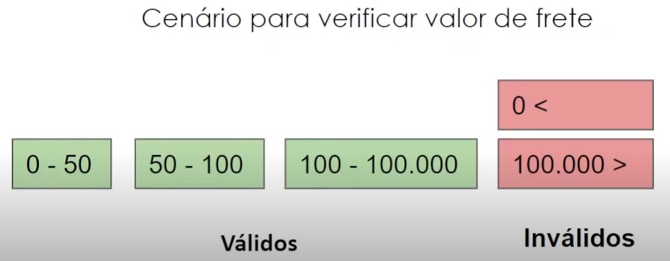

# Objetivos das Técnicas

Auxilio na identificação das condições de teste, casos e seus dados

Técnicas:
* Caixa-preta
* Caixa-branca
* Por experiência

## Técnicas de Caixa-preta

Fundamentadas em documentos de requisitos, casos de uso, histórias do usuário, etc...

São aplicáveis para testes funcionais ou não funcionais

Foco nas entradas e saídas do teste, abstraindo a estrutura interna:
* Particionamento de equivalência
* Análise de valor limite
* Tabela de decisão
* Transição de estado
* Caso de uso

### Particionamento de Equivalência

Divide os dados em partições ou classes de equivalência que são processados da mesma forma, em formatos válidos e inválidos

#### Exemplo

Um sistema de gestão e simulação de investimentos faz recomendações específicas dependendo da idade, tendo uma pontuação de risco de 0-100
* Até 18 anos: Investimentos com risco 60-80
* 18 até 40 anos: Investimentos com risco entre 40-60
* Idade > 40 anos: Investimentos com risco menor a idade máxima que o sistema faz previsões e simulações: 100 anos

    

  
    

### Análise de Valor Limite

Estende o particionamento de equivalência quando a partição é ordenada e podemos analisar o valor mínimo e máximo

#### Exemplo

Um sistema de gerenciamento de envio de mercadorias possui as seguintes regras:
* O cliente não paga frete acima de R$100
* Entre R$50 e R$100, paga R$20
* Menor que R$50, o frete sobe para R$35
* Caso o valor total da compra chegue a R$ 100.000 o cliente deve entrar em contato diretamente ou fazer uma nova compra

    

  
    

### Tabela de Decisões

Úteis para testar requisitos que especificam condições que fazem combinações com diferentes resultados

|Variáveis|1|2|3|4|
|:---:|:---:|:---:|:---:|:---:|
|Cartão válido?|Não|Sim|Sim|Sim|
|Senha Válida|X|Não|Sim|Sim|
|Valor solicitado é <= Saldo|X|X|Não|Sim|
|Saída Esperada|Cartão inválido|Senha inválida|Saldo insuficiente|Saque efetuado com sucesso|

### Transição de Estado

Situação emm que o sistema reage diferente a um evento dependendo das condições atuais ou de um histórico, que pode ser resumido como estado

#### Exemplo

Tentativa de login

  

É gerada uma tabela de transição que vai direcionar os casos de teste

||PIN Correto|PIN Incorreto|
|:---|:---:|:---:|
|S1) Iniciar|S5|S2|
|S2) 1ST tentativa|S5|S3|
|S3) 2ND tentativa|S5|S4|
|S4) 3RD tentativa|S5|S6|
|S5) Acesso concedido|-|-|
|S6) Conta bloqueada|-|-|

## Teste de Caso de Uso

* Derivados naturamente dos casos de uso
* Associa-se ações com os atores do caso
* Projeta-se testes para casos básicos, alternativos e de erros

## Técnicas de Caixa-Branca

Baseada na estrutura interna do objeto de teste

* Podem ser usadas em todos os níveis de teste
* Normalmente usada para testes a nível de componente no código-fonte

### Cobertura de Instruções

Testa instruções executáveis do código

Cobertura medida como (número de instruções executadas) / (total de instruções)

### Cobertura de Decisões

Testa as condicionais exeistentes no código e o que é executada em casa decisão

* Cobertura = número de resultados de decisão executados / total de resultados de decisão no objeto
* 100% de cobertura de decisão -> 100% de cobertura de instrução

## Técnicas Baseadas na Experiência

Baseada em experiência e intuição de quem testa

* Pode se identificar situações não encontradas nos métodos mais sistemáticos
* Cobertura de difícil avaliação e medição

1. Suposição de erro
2. Teste exploratório
3. Baseado em checklist
