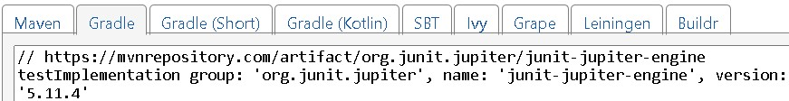
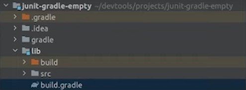

# Um Pouco de História

Framework open source para criação de testes unitários criado por Erich Gamma e Kent Beck
* Kent Beck (TDD)
* Erich Gamma (Gang of Four, Design Patterns)

## Configurando o Junit nos Projetos

Existem diversos gerenciador de dependencias para projetos Java, porem os mais conhecidos altuamente são o Maven e o Gradle.

* [MVN Repository](https://mvnrepository.com/)

### Passo a Passo

1. Buscar por Junit no buscador do MVN.
    <p>
    
    </p>
2. Acessar o JUnit Jupiter Engine.
    <p>
    
    </p>
3. Selecionar a versão desejada
    <p>
    
    </p>

#### Gradle

4. Escolher o gerenciador gradle e copiar o link
    <p>
    
    </p>
5. Acessar o repositório build.gradle dentro do projeto java
    <p>
    
    </p>
6. Colar dentro das dependencias o link copiado
    <p>
    
    </p>
7. Adicionar a plataforma JUnitPlatform
    <p>
    
    </p>

### Maven

4. Escolher o gerenciador maven e copiar o link
    <p>
    
    </p>
5. Acessar o repositório pom.xml
    <p>
    
    </p>
6. Colar dentro das dependencias o link copiado
    <p>
    
    </p>


## O Básico para Testar

### Arquivos de Teste

Os arquivos de testes devem ficar em um diretório separado do diretório principal (main)

<p align="center">
  
</p>

### Código

* @Test - Para indicar que é um método de teste
* void - Pois é sem retorno
* nome - Deve possuir um nome que facilite entender a intenção do teste

Para realizar o teste, passamos por dois momentos, onde o primeiro criamos um cenário e no segunda validamos se esta retornando o esperado

```java
public class PessoaTeste {
    @Test
    void deveCalcularIdadeCorretamente () {
        Pessoa jessica = new Pessoa( nome: "Jéssica", LocalDate.of(year2000, month:1, dayPfMonth:1, hour:15, minute:0, second:0));
        Assertions.assertEquals(expected:22, jessica.getIdade());
    } 
}
```

* Cenário - Passamos os dados como nome, data e hora
* Validação - Validamos utilizando a classe e métodos ```Assertions.assertEquals```, neste caso esperando que retorne a idade correta (22)

### Diversos Métodos em uma Classe

Podemos tambem criar mais de um métodos dentro da mesma classe

```java
public class PessoaTeste {
    @Test
    void deveCalcularIdadeCorretamente () {
        Pessoa jessica = new Pessoa( nome: "Jéssica", LocalDate.of(year2000, month:1, dayPfMonth:1, hour:15, minute:0, second:0));
        Assertions.assertEquals(expected:22, jessica.getIdade());
    } 

    @Test
    void validarMaiorIdade() {
        Pessoa jessica = new Pessoa( nome: "Jéssica", LocalDate.of(year2000, month:1, dayPfMonth:1, hour:15, minute:0, second:0))
        Assertions.asserTrue(jessica.eMaiorDeIdade())
    }
}
```

### Diversas Seções por Métodos

Podemos tambem criar mais de uma seção por métodos

```java
public class PessoaTeste {
    @Test
    void validarMaiorIdade() {
        Pessoa jessica = new Pessoa( nome: "Jéssica", LocalDate.of(year2000, month:1, dayPfMonth:1, hour:15, minute:0, second:0))
        Assertions.asserTrue(jessica.eMaiorDeIdade())

        Pessoa joao = new Pessoa(nome: "Jéssica", LocalTime.new())
        Assertions.asserFalse(joao.eMaiorDeIdade())
    }
}
```

Tambem pode ser feito varios

### Métodos da Classe Assertions

A classe assertions possui varias funções, onde cada uma servira para um tipo de validação diferente

* **assertEquals** = Valida se esta retornando o resultado esperado

    ```java
    Assertions.assertEquals(expected:22, jessica.getIdade());
    ```

    * Do lado esquerdo da virgula, informamos o valor esperado, ```expected:22```
    * Do lado direito, informamos oque chamaremos para o teste ```jessica.getIdade()```

* **assertTrue** = Valida se o valor retornado é verdadeiro

    ```java
    Assertions.asserTrue(jessica.eMaiorDeIdade())
    ```

    * Basta passar uma referencia para verificar se o valor dela é verdadeiro

* **assertFalse** = Valida se o valor retornado é Falso

    ```java
    Assertions.asserFalse(joao.eMaiorDeIdade())
    ```

    * Basta passar uma referencia para verificar se o valor dela é Falso  

* **assertArrayEquals** = Compara os arrays e verifica se eles são iguais

    ```java
    Assertions.assertArrayEquals(primeiroLancamento, segundoLancamento);
    ```

    * Os arrays devem ter o mesmo tamanho
    * Do lado esquerdo da virgula, informamos um array ```primeiroLancamento```
    * Do lado direito, informamoso outro array ```segundoLancamento```

* **assertNotEquals** = Compara os arrays e verifica se eles são diferentes

    ```java
    Assertions.assertNotEquals(primeiroLancamento, segundoLancamento);
    ```

    * Os arrays devem ter o mesmo tamanho
    * Do lado esquerdo da virgula, informamos um array ```primeiroLancamento```
    * Do lado direito, informamoso outro array ```segundoLancamento```

* **assertNull** = Verifica se um objeto esta nulo

    ```java
    Assertions.assertNull(pessoa);
    ```

    * Basta passar uma referencia para verificar se o valor dela esta null

* **assertNotNull** = Verifica se um objeto não esta nulo

    ```java
    Assertions.assertNotNull(pessoa);
    ```

    * Basta passar uma referencia para verificar se o valor dela esta null

## Importação estatica

Quando é necessário criar diversos testes, pode se tornar repetitivo chamar a classe ```Assertions```. Para simplificar, utilizamos a importação estática.

A importação estática deve ser feita no inicio do código, e temos duas formas de faze-la

### Importando Apenas Alguns Métodos

```java
import static org.junit.jupiter.api.Assertions.assertArrayEquals;
import static org.junit.jupiter.api.Assertions.assertNull;
import static org.junit.jupiter.api.Assertions.assertNotNull;
```

### Importando Todos Métodos

```java
import static org.junit.jupiter.api.Assertions.*;
```